# Guía de Integración Frontend - Ecommerce Backend API

## 📋 Tabla de Contenidos

1. [Introducción](#introducción)
2. [Tecnologías y Arquitectura](#tecnologías-y-arquitectura)
3. [Configuración y Entorno](#configuración-y-entorno)
4. [Sistema de Autenticación](#sistema-de-autenticación)
5. [Módulos y Endpoints](#módulos-y-endpoints)
6. [Flujos de Trabajo Comunes](#flujos-de-trabajo-comunes)
7. [Manejo de Errores](#manejo-de-errores)
8. [Integración con Next.js (Server-Side)](#integración-con-nextjs-serverside)
9. [Ejemplos de Código](#ejemplos-de-código)
10. [Consideraciones de Seguridad](#consideraciones-de-seguridad)

## 🚀 Introducción

Esta guía proporciona toda la información necesaria para integrar aplicaciones frontend con el backend API de Ecommerce, un sistema de e-commerce completo construido con NestJS.

### Características Principales

- **API RESTful** con documentación automática vía Swagger
- **Sistema de productos** con variaciones, plantillas y categorías jerárquicas
- **Carrito de compras** con soporte para usuarios autenticados y anónimos
- **Sistema de reseñas** con moderación
- **Pagos integrados** con MercadoPago
- **Gestión de imágenes** con Supabase
- **Precios por volumen** con tiers dinámicos
- **Autenticación flexible** vía headers o sesiones

## 🛠 Tecnologías y Arquitectura

### Stack Tecnológico

- **Framework**: NestJS (Node.js)
- **Lenguaje**: TypeScript
- **Base de Datos**: PostgreSQL con TypeORM
- **Documentación**: Swagger/OpenAPI
- **Almacenamiento**: Supabase Storage
- **Pagos**: MercadoPago SDK
- **Validación**: class-validator
- **CORS**: Habilitado para desarrollo

### Arquitectura General

```
┌─────────────────┐    ┌──────────────────┐    ┌─────────────────┐
│   Aplicación    │    │     NestJS       │    │   PostgreSQL    │
│   Frontend      │◄──►│     Backend      │◄──►│   Database      │
└─────────────────┘    └──────────────────┘    └─────────────────┘
                              │
                              ▼
                       ┌──────────────────┐
                       │    Supabase      │
                       │     Storage      │
                       └──────────────────┘
                              │
                              ▼
                       ┌──────────────────┐
                       │   MercadoPago    │
                       │     Gateway      │
                       └──────────────────┘
```

## ⚙️ Configuración y Entorno

### Variables de Entorno Requeridas

```bash
# Base de Datos
DB_HOST=localhost
DB_PORT=5432
DB_USERNAME=your_username
DB_PASSWORD=your_password
DB_NAME=ecommerce

# Servidor
PORT=3000

# Supabase (para imágenes)
SUPABASE_URL=your_supabase_url
SUPABASE_KEY=your_supabase_key
SUPABASE_STORAGE_BUCKET=images

# Rate Limiting
THROTTLE_TTL=60000
THROTTLE_LIMIT=10
```

### Configuración del Cliente HTTP

```javascript
// Ejemplo configuración base para Axios
const apiClient = axios.create({
  baseURL: 'http://localhost:3000/api',
  timeout: 10000,
  headers: {
    'Content-Type': 'application/json',
  },
});

// Interceptor para manejar errores globalmente
apiClient.interceptors.response.use(
  (response) => response,
  (error) => {
    if (error.response?.status === 429) {
      console.error('Rate limit exceeded');
    }
    return Promise.reject(error);
  },
);
```

## 🔐 Sistema de Autenticación

### Tipos de Autenticación

El sistema soporta **dos tipos de usuarios**:

1. **Usuarios Autenticados**: Identificados por header `x-user-id`
2. **Usuarios Anónimos**: Identificados por sesión (cookie `sessionId`)

### Headers Requeridos

```javascript
// Para usuarios autenticados
const headers = {
  'x-user-id': 'user-id-from-external-provider',
};

// Para usuarios anónimos, el sistema maneja automáticamente las sesiones
```

### Decorador @UserInfo

El backend utiliza un decorador personalizado que proporciona información del usuario en cada request:

```typescript
// En el controlador
@Get('cart')
async getCart(@UserInfo() userInfo: UserInfoType) {
  const { userId, sessionId } = userInfo;
  // userId: presente si es usuario autenticado
  // sessionId: presente si es usuario anónimo
}
```

## 📍 Módulos y Endpoints

### Base URL

```
http://localhost:3000/api
```

### Documentación Interactiva

- **Swagger UI**: `http://localhost:3000/api/docs`
- **JSON Schema**: `http://localhost:3000/api/docs-json`

---

## 🛒 Módulo de Productos

### Endpoints Principales

#### Obtener Productos con Detalles

```http
GET /products/with-details
```

**Response:**

```json
[
  {
    "id": "uuid",
    "template_id": "uuid",
    "sku": "MES-RUS-001",
    "name": "Mesa de Comedor Rústica",
    "price": 45000,
    "stock": 10,
    "attributes": {
      "color": "natural",
      "material": "madera",
      "dimensions": "200x100x75cm"
    },
    "is_active": true,
    "sort_order": 0,
    "images": [
      {
        "id": "uuid",
        "url": "https://bucket.supabase.co/images/uuid.jpg",
        "isMain": true,
        "sort_order": 0
      }
    ],
    "categories": [
      {
        "id": "uuid",
        "name": "Muebles",
        "slug": "muebles"
      }
    ],
    "created_at": "2024-01-01T00:00:00Z",
    "updated_at": "2024-01-01T00:00:00Z"
  }
]
```

#### Obtener Imagen de Producto

```http
GET /products/{id}/image
```

**Headers:**

```
Content-Type: image/jpeg
Cache-Control: public, max-age=3600
```

#### Crear Producto con Imágenes

```http
POST /products
Content-Type: multipart/form-data
```

**Body (Form Data):**

- `sku`: Código único del producto
- `name`: Nombre del producto
- `price`: Precio (número)
- `attributes`: Atributos en JSON string
- `inStock`: Disponibilidad (true/false)
- `template_id`: ID de plantilla (opcional)
- `files`: Archivos de imagen (múltiples)

**Ejemplo:**

```javascript
const formData = new FormData();
formData.append('sku', 'MES-RUS-001');
formData.append('name', 'Mesa de Comedor Rústica');
formData.append('price', '45000');
formData.append(
  'attributes',
  JSON.stringify({
    color: 'natural',
    material: 'madera',
  }),
);
formData.append('inStock', 'true');
formData.append('files', imageFile1);
formData.append('files', imageFile2);
```

#### Actualizar Producto

```http
PUT /products/{id}
PATCH /products/{id}
```

#### Eliminar Producto

```http
DELETE /products/{id}
```

---

## 🛒 Módulo de Carrito de Compras

### Endpoints Principales

#### Obtener Carrito Actual

```http
GET /cart
```

**Response:**

```json
{
  "id": "uuid",
  "userId": "user-id-or-null",
  "sessionId": "session-id-or-null",
  "items": [
    {
      "id": "uuid",
      "productVariation": {
        "id": "uuid",
        "sku": "MES-RUS-001",
        "name": "Mesa de Comedor Rústica",
        "price": 45000
      },
      "quantity": 2,
      "unitPrice": 45000,
      "totalPrice": 90000
    }
  ],
  "totalItems": 2,
  "totalPrice": 90000,
  "createdAt": "2024-01-01T00:00:00Z",
  "updatedAt": "2024-01-01T00:00:00Z"
}
```

#### Agregar Producto al Carrito

```http
POST /cart/items
```

**Body:**

```json
{
  "productVariationId": "uuid-del-producto",
  "quantity": 2
}
```

#### Actualizar Cantidad en Carrito

```http
PATCH /cart/items/{itemId}
```

**Body:**

```json
{
  "quantity": 3
}
```

#### Remover Producto del Carrito

```http
DELETE /cart/items/{itemId}
```

#### Limpiar Carrito

```http
DELETE /cart/clear
```

---

## 📂 Módulo de Categorías

### Endpoints Principales

#### Obtener Árbol de Categorías

```http
GET /categories/tree
```

**Response:**

```json
[
  {
    "id": "uuid",
    "name": "Muebles",
    "slug": "muebles",
    "parent_id": null,
    "children": [
      {
        "id": "uuid",
        "name": "Mesas",
        "slug": "mesas",
        "parent_id": "uuid-muebles",
        "children": []
      }
    ]
  }
]
```

#### Crear Categoría

```http
POST /categories
```

**Body:**

```json
{
  "name": "Nueva Categoría",
  "slug": "nueva-categoria",
  "parent_id": "uuid-padre-opcional"
}
```

#### Mover Categoría

```http
POST /categories/{id}/move
```

**Body:**

```json
{
  "parent_id": "uuid-nuevo-padre",
  "sort_order": 1
}
```

---

## ⭐ Módulo de Reseñas

### Endpoints Principales

#### Crear Reseña (Requiere Autenticación)

```http
POST /reviews
x-user-id: usuario-id-del-provider-externo
```

**Headers Requeridos:**

```
x-user-id: usuario-id-del-provider-externo
```

**Body:**

```json
{
  "productVariationId": "uuid-del-producto",
  "rating": 5,
  "title": "Excelente producto",
  "comment": "Muy buena calidad y entrega rápida",
  "images": ["array", "de", "base64", "images"]
}
```

#### Obtener Reseñas de Producto

```http
GET /reviews/product/{productVariationId}?page=1&limit=10&sort=rating&order=desc
```

**Query Parameters:**

- `page`: Número de página (default: 1)
- `limit`: Items por página (default: 10)
- `sort`: Campo de ordenamiento (rating, created_at, helpful)
- `order`: Dirección (asc, desc)

**Response:**

```json
{
  "reviews": [
    {
      "id": "uuid",
      "productVariationId": "uuid",
      "userId": "uuid",
      "rating": 5,
      "title": "Excelente producto",
      "comment": "Muy buena calidad",
      "isVerified": true,
      "helpful": 3,
      "images": [
        {
          "id": "uuid",
          "url": "https://bucket.supabase.co/images/uuid.jpg"
        }
      ],
      "created_at": "2024-01-01T00:00:00Z"
    }
  ],
  "total": 25
}
```

#### Marcar Reseña como Útil

```http
POST /reviews/{id}/helpful
```

#### Reportar Reseña

```http
POST /reviews/{id}/report
```

---

## 💳 Módulo de Pagos

### Endpoints Principales

#### Crear Preferencia de Pago

```http
POST /payments/mercadopago/checkout
```

**Response:**

```json
{
  "id": "mp-preference-id",
  "init_point": "https://mp.com/checkout/init_point",
  "sandbox_init_point": "https://mp-sandbox.com/checkout/init_point"
}
```

#### Webhook de MercadoPago

```http
POST /payments/mercadopago/webhook
```

**Nota:** Este endpoint es manejado automáticamente por el backend para procesar notificaciones de pago.

---

## 🖼️ Módulo de Almacenamiento

### Endpoints Principales

#### Subir Imagen

```http
POST /storage/upload
Content-Type: multipart/form-data
```

**Body:**

- `file`: Archivo de imagen
- `folder`: Carpeta destino (opcional)

**Response:**

```json
{
  "url": "https://bucket.supabase.co/images/uuid.jpg",
  "path": "images/uuid.jpg",
  "id": "uuid"
}
```

---

## 👥 Módulo de Usuarios

### Endpoints Principales

#### Crear Usuario

```http
POST /users
```

**Body:**

```json
{
  "email": "usuario@ejemplo.com",
  "firstName": "Nombre",
  "lastName": "Apellido"
}
```

#### Obtener Usuario por Email

```http
GET /users/{email}
```

#### Actualizar Usuario

```http
PATCH /users/{id}
```

---

## 🏥 Health Check

#### Verificar Estado del Servicio

```http
GET /health
```

**Response:**

```json
{
  "status": "ok",
  "version": "1.0.0",
  "checks": {
    "database": {
      "status": "up"
    }
  }
}
```

## 🔄 Flujos de Trabajo Comunes

### Flujo de Compra Completo


### Flujo de Gestión de Productos

```mermaid
sequenceDiagram
    participant A as Admin Frontend
    participant B as Backend
    participant S as Supabase

    A->>B: POST /products (con imágenes)
    B->>S: Subir imágenes
    B->>B: Crear producto
    B->>A: Producto creado

    A->>B: GET /categories/tree
    B->>A: Árbol de categorías

    A->>B: POST /categories (nueva categoría)
    B->>A: Categoría creada
```



## ❌ Manejo de Errores

### Códigos de Estado HTTP

| Código | Descripción           | Uso Típico                        |
| ------ | --------------------- | --------------------------------- |
| 200    | OK                    | Operación exitosa                 |
| 201    | Created               | Recurso creado                    |
| 204    | No Content            | Eliminación exitosa               |
| 400    | Bad Request           | Datos inválidos                   |
| 401    | Unauthorized          | Usuario no autenticado            |
| 403    | Forbidden             | Permisos insuficientes            |
| 404    | Not Found             | Recurso no encontrado             |
| 409    | Conflict              | Conflicto (ej: usuario ya existe) |
| 422    | Unprocessable Entity  | Validación fallida                |
| 429    | Too Many Requests     | Rate limit excedido               |
| 500    | Internal Server Error | Error interno del servidor        |

### Ejemplo de Respuesta de Error

```json
{
  "statusCode": 400,
  "message": ["sku must be a string", "price must be a positive number"],
  "error": "Bad Request"
}
```

### Manejo de Errores en Frontend

```javascript
try {
  const response = await apiClient.post('/products', productData);
  console.log('Producto creado:', response.data);
} catch (error) {
  if (error.response?.status === 429) {
    showRateLimitMessage();
  } else if (error.response?.status >= 400 && error.response?.status < 500) {
    showValidationErrors(error.response.data.message);
  } else {
    showGenericError();
  }
}
```

## 🚀 Integración con Next.js (Server-Side)

### ¿Por qué Server-Side Requests?

Para aplicaciones Next.js, se recomienda **fuertemente** hacer los requests del lado del servidor por varias razones:

- **🔒 Seguridad**: No exponer URLs del backend ni credenciales en el cliente
- **⚡ Performance**: Mejor carga inicial y SEO
- **🛡️ Protección**: Headers de autenticación seguros
- **📱 UX**: Evitar flashes de contenido y rehydratación

### Configuración del Cliente API (Next.js)

```typescript
// lib/api-client.ts
import axios from 'axios';

class EcommerceAPI {
  private baseURL: string;
  private apiClient: any;

  constructor(baseURL?: string) {
    this.baseURL =
      baseURL || process.env.NEXT_PUBLIC_API_URL || 'http://localhost:3000/api';
  }

  private getClient() {
    if (!this.apiClient) {
      this.apiClient = axios.create({
        baseURL: this.baseURL,
        timeout: 10000,
      });
    }
    return this.apiClient;
  }

  // Método para requests del servidor
  async serverRequest(
    endpoint: string,
    options: {
      method?: 'GET' | 'POST' | 'PUT' | 'PATCH' | 'DELETE';
      body?: any;
      headers?: Record<string, string>;
    } = {},
  ) {
    const client = this.getClient();

    const requestHeaders = {
      'Content-Type': 'application/json',
      ...options.headers,
    };

    return client.request({
      url: endpoint,
      method: options.method || 'GET',
      data: options.body,
      headers: requestHeaders,
    });
  }

  // Método para requests del cliente (solo cuando sea necesario)
  getClientInstance() {
    return this.getClient();
  }
}

export const apiClient = new EcommerceAPI();
```

### Server Components (App Router)

```typescript
// app/products/page.tsx
import { apiClient } from '@/lib/api-client';

export default async function ProductsPage() {
  // ✅ Request del lado del servidor - SEGURO
  const productsResponse = await apiClient.serverRequest('/products/with-details');

  const products = productsResponse.data;

  return (
    <div>
      <h1>Productos</h1>
      <div className="grid grid-cols-1 md:grid-cols-3 gap-4">
        {products.map((product: any) => (
          <ProductCard key={product.id} product={product} />
        ))}
      </div>
    </div>
  );
}
```

### Server Actions (Mutaciones)

```typescript
// app/actions/cart-actions.ts
'use server';

import { apiClient } from '@/lib/api-client';
import { cookies } from 'next/headers';
import { redirect } from 'next/navigation';

export async function addToCartAction(
  productVariationId: string,
  quantity: number,
) {
  try {
    // ✅ Request del servidor con manejo de sesiones
    const cookieStore = cookies();
    const sessionId = cookieStore.get('sessionId')?.value;

    await apiClient.serverRequest('/cart/items', {
      method: 'POST',
      body: { productVariationId, quantity },
      headers: {
        'x-session-id': sessionId || '',
      },
    });

    // Revalidar datos si es necesario
    revalidatePath('/cart');

    return { success: true };
  } catch (error) {
    console.error('Error adding to cart:', error);
    return { success: false, error: 'Error al agregar al carrito' };
  }
}

export async function createReviewAction(reviewData: {
  productVariationId: string;
  rating: number;
  title: string;
  comment: string;
}) {
  'use server';

  try {
    // ✅ Request autenticado del servidor
    const userId = await getCurrentUserId(); // Función helper para obtener user ID

    if (!userId) {
      redirect('/login');
    }

    await apiClient.serverRequest('/reviews', {
      method: 'POST',
      body: reviewData,
      headers: {
        'x-user-id': userId,
      },
    });

    revalidatePath(`/products/${reviewData.productVariationId}`);
    return { success: true };
  } catch (error) {
    return { success: false, error: 'Error al crear reseña' };
  }
}
```

### Route Handlers (API Routes)

```typescript
// app/api/cart/route.ts
import { apiClient } from '@/lib/api-client';
import { NextRequest, NextResponse } from 'next/server';

export async function GET() {
  try {
    // ✅ Request del servidor con manejo de cookies
    const response = await apiClient.serverRequest('/cart');

    return NextResponse.json(response.data);
  } catch (error) {
    return NextResponse.json(
      { error: 'Error al obtener carrito' },
      { status: 500 },
    );
  }
}

export async function POST(request: NextRequest) {
  try {
    const body = await request.json();

    // ✅ Request del servidor con autenticación
    const userId = request.headers.get('x-user-id');

    const response = await apiClient.serverRequest('/cart/items', {
      method: 'POST',
      body,
      headers: userId ? { 'x-user-id': userId } : {},
    });

    return NextResponse.json(response.data, { status: 201 });
  } catch (error) {
    return NextResponse.json(
      { error: 'Error al agregar al carrito' },
      { status: 400 },
    );
  }
}
```

### Helper Functions para Autenticación

```typescript
// lib/auth-helpers.ts
import { cookies } from 'next/headers';
import { redirect } from 'next/navigation';

export async function getCurrentUserId(): Promise<string | null> {
  // Esta función debería obtener el user ID de tu sistema de autenticación
  // Ejemplo con NextAuth.js:
  // const session = await getServerSession(authOptions);
  // return session?.user?.id || null;

  // Ejemplo con Auth0:
  // const session = await getSession();
  // return session?.user?.sub || null;

  // Por ahora, retornamos null como ejemplo
  return null;
}

export async function getSessionId(): Promise<string | null> {
  const cookieStore = cookies();
  return cookieStore.get('sessionId')?.value || null;
}

export function requireAuth(): string {
  const userId = getCurrentUserId();
  if (!userId) {
    redirect('/login');
  }
  return userId;
}
```

### Client Components (Solo cuando sea necesario)

```typescript
// components/AddToCartButton.tsx
'use client';

import { useTransition } from 'react';
import { addToCartAction } from '@/app/actions/cart-actions';

interface AddToCartButtonProps {
  productId: string;
}

export function AddToCartButton({ productId }: AddToCartButtonProps) {
  const [isPending, startTransition] = useTransition();

  const handleAddToCart = () => {
    startTransition(async () => {
      const result = await addToCartAction(productId, 1);

      if (result.success) {
        // Mostrar notificación de éxito
        toast.success('Producto agregado al carrito');
      } else {
        // Mostrar error
        toast.error(result.error);
      }
    });
  };

  return (
    <button
      onClick={handleAddToCart}
      disabled={isPending}
      className="btn btn-primary"
    >
      {isPending ? 'Agregando...' : 'Agregar al Carrito'}
    </button>
  );
}
```

### Middleware para Protección de Rutas

```typescript
// middleware.ts
import { NextResponse } from 'next/server';
import type { NextRequest } from 'next/server';

export function middleware(request: NextRequest) {
  // Proteger rutas que requieren autenticación
  if (request.nextUrl.pathname.startsWith('/admin')) {
    const userId = request.headers.get('x-user-id');

    if (!userId) {
      return NextResponse.redirect(new URL('/login', request.url));
    }
  }

  // Pasar headers importantes al backend
  const response = NextResponse.next();
  const userId = request.headers.get('x-user-id');
  const sessionId = request.cookies.get('sessionId')?.value;

  if (userId || sessionId) {
    // Estos headers se enviarán automáticamente a las requests del servidor
    response.headers.set('x-user-id', userId || '');
    response.headers.set('x-session-id', sessionId || '');
  }

  return response;
}

export const config = {
  matcher: ['/admin/:path*', '/checkout/:path*'],
};
```

### Ejemplo de Página Completa con Server Components

```typescript
// app/products/[id]/page.tsx
import { apiClient } from '@/lib/api-client';
import { notFound } from 'next/navigation';
import { Metadata } from 'next';

interface ProductPageProps {
  params: { id: string };
}

export async function generateMetadata({ params }: ProductPageProps): Promise<Metadata> {
  try {
    const response = await apiClient.serverRequest(`/products/${params.id}`);
    const product = response.data;

    return {
      title: `${product.name} - Ecommerce`,
      description: `Compra ${product.name} por $${product.price}`,
    };
  } catch {
    return {
      title: 'Producto no encontrado - Ecommerce',
    };
  }
}

export default async function ProductPage({ params }: ProductPageProps) {
  try {
    // ✅ Request del servidor para datos del producto
    const productResponse = await apiClient.serverRequest(`/products/${params.id}`);
    const product = productResponse.data;

    // ✅ Request del servidor para reseñas
    const reviewsResponse = await apiClient.serverRequest(
      `/reviews/product/${params.id}?limit=5&sort=rating&order=desc`
    );
    const { reviews, total } = reviewsResponse.data;

    return (
      <div className="container mx-auto px-4 py-8">
        <ProductDetails product={product} />
        <ReviewsSection reviews={reviews} total={total} />
        <AddToCartButton productId={product.id} />
      </div>
    );
  } catch (error) {
    notFound();
  }
}
```

### Manejo de Errores en Server Components

```typescript
// app/error.tsx (Global Error Boundary)
'use client';

export default function Error({
  error,
  reset,
}: {
  error: Error & { digest?: string };
  reset: () => void;
}) {
  return (
    <div className="min-h-screen flex items-center justify-center">
      <div className="text-center">
        <h2 className="text-2xl font-bold mb-4">Algo salió mal</h2>
        <p className="text-gray-600 mb-4">
          {error.message || 'Error interno del servidor'}
        </p>
        <button
          onClick={reset}
          className="btn btn-primary"
        >
          Intentar de nuevo
        </button>
      </div>
    </div>
  );
}
```

### Ventajas de este Enfoque

| Aspecto             | Server-Side              | Client-Side            |
| ------------------- | ------------------------ | ---------------------- |
| **Seguridad**       | ✅ Headers seguros       | ❌ Exposición de datos |
| **SEO**             | ✅ Server-side rendering | ❌ SPA limitado        |
| **Performance**     | ✅ Carga inicial rápida  | ❌ Request waterfall   |
| **Caching**         | ✅ HTTP caching          | ❌ Cliente-side only   |
| **User Experience** | ✅ No flashing           | ⚠️ Posible flashing    |

### Mejores Prácticas

1. **Usar Server Components** para contenido estático y datos públicos
2. **Usar Server Actions** para mutaciones y formularios
3. **Usar Route Handlers** para APIs personalizadas
4. **Usar Client Components** solo cuando necesites interactividad
5. **Implementar Error Boundaries** para manejo robusto de errores
6. **Configurar Middleware** para protección de rutas y headers

Este enfoque proporciona la mejor combinación de seguridad, performance y experiencia de usuario para aplicaciones Next.js modernas! 🚀

## 💻 Ejemplos de Código

### Cliente JavaScript/TypeScript Completo

```javascript
class EcommerceAPI {
  constructor(baseURL = 'http://localhost:3000/api') {
    this.baseURL = baseURL;
    this.apiClient = axios.create({
      baseURL,
      timeout: 10000,
    });

    // Configurar autenticación
    this.setAuthToken = (userId) => {
      this.apiClient.defaults.headers['x-user-id'] = userId;
    };

    this.clearAuthToken = () => {
      delete this.apiClient.defaults.headers['x-user-id'];
    };
  }

  // Productos
  async getProducts() {
    return this.apiClient.get('/products/with-details');
  }

  async createProduct(productData, images = []) {
    const formData = new FormData();

    Object.keys(productData).forEach((key) => {
      if (typeof productData[key] === 'object') {
        formData.append(key, JSON.stringify(productData[key]));
      } else {
        formData.append(key, productData[key]);
      }
    });

    images.forEach((image) => {
      formData.append('files', image);
    });

    return this.apiClient.post('/products', formData, {
      headers: { 'Content-Type': 'multipart/form-data' },
    });
  }

  // Carrito
  async getCart() {
    return this.apiClient.get('/cart');
  }

  async addToCart(productVariationId, quantity) {
    return this.apiClient.post('/cart/items', {
      productVariationId,
      quantity,
    });
  }

  async updateCartItem(itemId, quantity) {
    return this.apiClient.patch(`/cart/items/${itemId}`, {
      quantity,
    });
  }

  async removeFromCart(itemId) {
    return this.apiClient.delete(`/cart/items/${itemId}`);
  }

  async clearCart() {
    return this.apiClient.delete('/cart/clear');
  }

  // Pagos
  async createCheckout() {
    return this.apiClient.post('/payments/mercadopago/checkout');
  }

  // Reseñas
  async createReview(reviewData) {
    return this.apiClient.post('/reviews', reviewData);
  }

  async getProductReviews(productVariationId, params = {}) {
    return this.apiClient.get(`/reviews/product/${productVariationId}`, {
      params,
    });
  }

  // Categorías
  async getCategoriesTree() {
    return this.apiClient.get('/categories/tree');
  }
}

// Uso
const api = new EcommerceAPI();

// Configurar autenticación si el usuario está logueado
if (currentUser) {
  api.setAuthToken(currentUser.id);
}

// Ejemplo de flujo completo
async function ejemploFlujoCompra() {
  try {
    // 1. Obtener productos
    const products = await api.getProducts();
    console.log('Productos disponibles:', products.data);

    // 2. Agregar productos al carrito
    await api.addToCart(products.data[0].id, 2);

    // 3. Ver carrito actual
    const cart = await api.getCart();
    console.log('Carrito:', cart.data);

    // 4. Proceder al pago
    if (currentUser) {
      const checkout = await api.createCheckout();
      window.location.href = checkout.data.init_point;
    }
  } catch (error) {
    console.error('Error en flujo de compra:', error);
  }
}
```

### React Hook Personalizado

```javascript
import { useState, useEffect } from 'react';
import { EcommerceAPI } from './api';

export const useCart = () => {
  const [cart, setCart] = useState(null);
  const [loading, setLoading] = useState(false);
  const [error, setError] = useState(null);

  const api = new EcommerceAPI();

  const fetchCart = async () => {
    setLoading(true);
    try {
      const response = await api.getCart();
      setCart(response.data);
      setError(null);
    } catch (err) {
      setError(err.message);
    } finally {
      setLoading(false);
    }
  };

  const addToCart = async (productVariationId, quantity) => {
    setLoading(true);
    try {
      await api.addToCart(productVariationId, quantity);
      await fetchCart(); // Refrescar carrito
    } catch (err) {
      setError(err.message);
    } finally {
      setLoading(false);
    }
  };

  useEffect(() => {
    fetchCart();
  }, []);

  return {
    cart,
    loading,
    error,
    addToCart,
    refetch: fetchCart,
  };
};
```

## 🔒 Consideraciones de Seguridad

### Rate Limiting

- **Límite**: 10 requests por minuto por IP
- **Header**: `X-RateLimit-Remaining` indica requests restantes
- **Error 429**: Cuando se excede el límite

### CORS

- Configurado para permitir desarrollo local
- Headers permitidos: `x-user-id`, `x-session-id`

### Validación de Datos

- Todas las entradas son validadas usando class-validator
- Sanitización automática de datos
- Protección contra inyección de datos maliciosos

### Autenticación

- Sistema híbrido (autenticado/anónimo)
- No almacena credenciales sensibles
- Usa UUIDs para identificación segura

## 🚦 Próximos Pasos

1. **Configurar entorno**: Crear archivo `.env` con las variables necesarias
2. **Probar endpoints**: Usar Swagger UI para probar la API
3. **Implementar cliente**: Crear wrapper para facilitar el uso
4. **Manejar errores**: Implementar manejo robusto de errores
5. **Optimizar rendimiento**: Implementar caché y optimizaciones

## 📞 Soporte

Para preguntas o soporte técnico:

- Documentación interactiva: `http://localhost:3000/api/docs`
- Issues: Crear issue en el repositorio
- Logs: Revisar logs del servidor para debugging

---

**¡Éxito con tu integración! 🎉**
